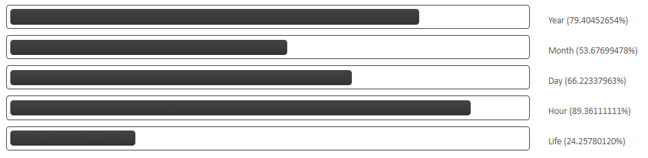

# Embeddable life and time progress bar

## URL Parameters

- birth_year (0-9999)
- birth_month (1-12)
- birth_day (1-31)
- life_length (1-999)

## Example URL
https://drandarov-io.github.io/embed-life-time-progressbars/docs/?birth_day=15&birth_month=7&birth_year=1996&life_length=100

## Examples

